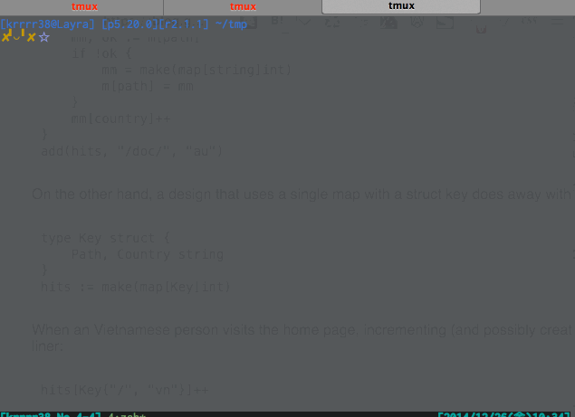

gpshow
====

Go port of [picture-show](https://github.com/softprops/picture-show)

## Description
make slideshows with markdown text

- Simplest handing to show slides
- Syntax Highlight for any developpers
- Enable to export static files

## Usage

#### Basic Usage
Create slide project from template, and start slide show.
```bash
$ gpshow init myslide
$ cd myslide
$ gpshow
$ open http://localhost:3000
```



#### With Gist
If there are markdowns in gists...
```bash
$ gpshow gist https://gist.github.com/krrrr38/bf375a762497af9534e1
```

#### Generate static slides
Export static files
```bash
$ gpshow offline
```

## Install

To install, use `go get`:

```bash
$ go get -d github.com/krrrr38/gpshow
$ make install
$ gpshow --help
```

## Contribution

1. Fork ([https://github.com/krrrr38/gpshow/fork](https://github.com/krrrr38/gpshow/fork))
1. Create a feature branch
1. Commit your changes
1. Rebase your local changes against the master branch
1. Run test suite with the `make test` command and confirm that it passes
1. Run `gofmt -s`
1. Create new Pull Request

## Author

[krrrr38](https://github.com/krrrr38)
